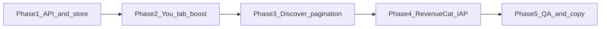

# Mobile App Implementation Plan — Boost + Discover Updates

This plan covers the **production mobile client** (React Native, Expo, or similar) against the backend changes already shipped. The interactive design reference lives in `frontend/app data/Ohrny mobile/`; there is no native app in the repo yet.

---

## Backend contract (source of truth)

These are the endpoints and fields the mobile app must use.

### Entitlements — `GET /api/user/entitlements`

```json
{
  "plan": "free | plus | platin | private",
  "balances": {
    "boostsLeft": 0,
    "superLikesLeft": 0
  },
  "activeBoost": {
    "id": "uuid",
    "startedAt": "ISO8601",
    "expiresAt": "ISO8601"
  },
  "features": {
    "weeklyBoost": true
  }
}
```

- `activeBoost` is `null` when no boost is running.
- `activeBoost` is the **running 30-minute window**, not inventory.
- Platin weekly grant adds **+1 to `boostsLeft`**; user must still tap Activate.

### Activate boost — `POST /api/user/boosts/activate`

- Body: `{}` (empty)
- **200:** `{ ok: true, boost: { id, startedAt, expiresAt, ... } }`
- **403:** `{ error: "insufficient_balance", type: "boosts" }` → open purchase sheet
- **409:** `{ error: "boost_already_active", activeBoost: { ... } }` → sync timer from server

### Discover — `GET /api/user/discover/cards`

Query: `limit`, `cursor`, `resetPasses`, `resetAll`

Response:

```json
{
  "cards": [
    {
      "id": "uuid",
      "handle": "...",
      "isBoosted": true
    }
  ],
  "nextCursor": "base64url-v2-cursor",
  "hasMore": true
}
```

- **Sort order (server-side):** boosted first → compat tier → distance → id
- **Cursor v2** encodes all sort keys: `2|boostRank|compatRank|distance|id`
- Client must pass `nextCursor` back **unchanged** — do not parse or rebuild it
- Legacy cursors (`distance|id`) still work briefly; new sessions always get v2

### Boost packs (IAP)

- RevenueCat product IDs matching `boost.*1|5|10` credit `users.boosts_left`
- After purchase: refetch entitlements (webhook is async; poll once if balance unchanged)

---

## Phase 1 — API & state foundation

**Goal:** One shared layer every screen uses.

### 1.1 API client module

Create something like `mobile/src/api/client.ts`:

| Method | Path | Notes |
|--------|------|-------|
| `getEntitlements()` | `GET /user/entitlements` | Auth required |
| `activateBoost()` | `POST /user/boosts/activate` | Empty body |
| `getDiscoverCards(params)` | `GET /user/discover/cards` | Pass `cursor` opaquely |

- Base URL from env (`OHRNY_API_BASE`)
- Attach `Authorization: Bearer <userAccessToken>`
- Return `{ status, data }` for boost activate so UI can branch on 403/409

### 1.2 TypeScript types

```ts
type ActiveBoost = { id: string; startedAt: string; expiresAt: string } | null

type Entitlements = {
  plan: 'free' | 'plus' | 'platin' | 'private'
  balances: { boostsLeft: number; superLikesLeft: number }
  activeBoost: ActiveBoost
  features: { weeklyBoost?: boolean }
}

type DiscoverCard = {
  id: string
  isBoosted: boolean
  // ...existing card fields
}
```

### 1.3 Entitlements store (global)

Use React Context, Zustand, or TanStack Query — whichever fits your stack.

**State:**

```ts
{
  entitlements: Entitlements | null
  isLoading: boolean
  lastFetchedAt: number
}
```

**Actions:**

- `refreshEntitlements()` — on app launch, foreground, after IAP, after activate
- `setActiveBoost(boost)` — optimistic update from activate response
- `tickBoostExpiry()` — clear `activeBoost` when `expiresAt` passes locally

**Do not** assume paid plans start with 1 boost; default balances to `0` until server responds.

---

## Phase 2 — You tab: Boost UX

**Design reference:** `MyProfileLive` in `frontend/app data/Ohrny mobile/live-screens-d.jsx`.

### 2.1 Boost StatCard — three states

| State | Condition | UI | Tap action |
|-------|-----------|-----|------------|
| **Active** | `activeBoost.expiresAt > now` | Show `Xm` countdown, label “Boost active” | Toast: “Boost active · X min left” |
| **Ready** | `boostsLeft > 0`, no active boost | Show balance count | Call `POST /user/boosts/activate` |
| **Empty** | `boostsLeft === 0` | Show `0`, label “Get Boosts” | Open purchase sheet |

### 2.2 Activate flow

```
onBoostTap()
  if boostActive → show status toast
  if boostsLeft === 0 → open PurchaseSheet('boost')
  else
    set loading
    res = POST /user/boosts/activate
    200 → set activeBoost, boostsLeft -= 1, success toast
    403 → open purchase sheet
    409 → set activeBoost from body, info toast
    network → error toast
    finally clear loading
```

Success copy (aligned with backend):

> “Boost activated · top of the deck for 30 min”

### 2.3 Countdown timer

- Derive `minsLeft = ceil((expiresAt - now) / 60000)` from `activeBoost.expiresAt`
- Re-render every 15–30s while active
- On expiry: set `activeBoost = null`, call `refreshEntitlements()` to resync

### 2.4 Purchase sheet (Boost packs)

- Packs: 1 / 5 / 10 (€4.99 / €14.99 / €19.99 per prototype)
- Integrate RevenueCat `purchasePackage()`
- On success: `refreshEntitlements()`; if balance still 0, retry once after 2s (webhook lag)
- Do **not** auto-activate after purchase — user taps Boost again

### 2.5 Plan copy updates

Replace misleading copy everywhere (plans carousel, Platin detail, FAQs):

| Old | New |
|-----|-----|
| “Weekly profile boost” | “1 free Boost credited weekly” |
| “Be seen 10× more” | “Top of the deck for 30 min when activated” |
| “Gold” tier | `platin` / `private` only |

Plan enum must match backend: `free | plus | platin | private`.

---

## Phase 3 — Discover feed integration

**Goal:** Correct pagination + optional boosted badge; no client-side re-sorting.

### 3.1 Pagination

```ts
// First page
GET /user/discover/cards?limit=20

// Next page — pass cursor exactly as returned
GET /user/discover/cards?limit=20&cursor=<nextCursor>
```

Rules:

- Store `nextCursor` and `hasMore` from each response
- Append cards on infinite scroll; reset cursor on deck refresh (`resetPasses` / `resetAll`)
- **Never** sort cards client-side by distance or boost — server order is authoritative

### 3.2 Optional UI: `isBoosted` on cards

Backend returns `isBoosted: boolean` per card.

Use only for **display** if product wants it (e.g. subtle bolt badge). Do **not** re-sort by this field.

For **your own** profile while boosting: show banner on You tab, not on discover (you don’t see yourself in deck).

### 3.3 Deck refresh triggers

Refetch page 1 (clear cursor) when:

- User activates boost (others will see you first on their next fetch)
- User changes discover prefs (distance, global mode, advanced compatibility)
- App returns to foreground after >5 min

---

## Phase 4 — Lifecycle & sync

### When to call `GET /user/entitlements`

| Event | Action |
|-------|--------|
| App launch / login | Full refresh |
| Enter You tab | Refresh if stale >60s |
| App foreground | Refresh if stale >60s |
| After boost activate | Update from response + refresh |
| After RevenueCat purchase | Refresh (+ optional retry) |
| Push: subscription updated (if added later) | Refresh |

### Local vs server clock

- Always trust `expiresAt` from server for countdown
- If local countdown hits 0 but server still has `activeBoost`, refresh entitlements once

---

## Phase 5 — Suggested module layout

```
mobile/
  src/
    api/
      client.ts
      entitlements.ts      # getEntitlements, activateBoost
      discover.ts          # getDiscoverCards
    types/
      entitlements.ts
      discover.ts
    stores/
      useEntitlements.ts   # global boost/plan state
    hooks/
      useActiveBoost.ts    # countdown + expiry
      useDiscoverDeck.ts   # cursor pagination
    screens/
      You/
        YouScreen.tsx
        BoostPurchaseSheet.tsx
      Discover/
        DiscoverScreen.tsx
        DiscoverCard.tsx   # optional isBoosted badge
    services/
      revenueCat.ts        # boost pack SKUs
```

---

## Phase 6 — Testing checklist

### Boost / You tab

- [ ] Free user, `boostsLeft: 0` → tap opens purchase sheet
- [ ] User with balance → activate → balance −1, countdown starts at ~30 min
- [ ] Double-tap activate → 409 handled, timer shows existing boost
- [ ] Activate with 0 balance (race) → 403 → purchase sheet
- [ ] Countdown reaches 0 → UI clears active state
- [ ] Foreground after 20 min → timer still correct from server

### Discover

- [ ] Page 1 loads without cursor
- [ ] Page 2+ uses opaque `nextCursor`; no duplicates or skips
- [ ] Boosted test user appears before non-boosted on page 1
- [ ] With 25+ candidates and limit 10, boosted users still appear first on page 2+ (regression for old cursor bug)
- [ ] `resetAll=true` clears cursor and restarts deck

### IAP

- [ ] Buy 1/5/10 pack → `boostsLeft` increases after webhook
- [ ] Purchase does not auto-start boost

### Copy

- [ ] No “Gold” tier in UI
- [ ] Platin copy says “credited weekly”, not “auto boost”

---

## Phase 7 — Rollout order



Recommended sprint split:

1. **Sprint A:** API client + entitlements store + You tab activate/countdown (no IAP yet; test with seeded `boosts_left` in DB)
2. **Sprint B:** Discover cursor pagination + manual QA with boosted seed users
3. **Sprint C:** RevenueCat boost packs + plan copy pass
4. **Sprint D:** Edge cases, foreground sync, analytics events

---

## Analytics events (recommended)

| Event | When |
|-------|------|
| `boost_tap` | User taps Boost stat |
| `boost_activate_success` | 200 from activate |
| `boost_activate_blocked` | 403 / 409 |
| `boost_purchase_started` | Purchase sheet opened |
| `boost_purchase_completed` | RevenueCat success |
| `discover_page_loaded` | `{ page, hasBoostedCard }` |

---

## Prototype → production mapping

The gitignored prototype demonstrates target behavior in `live-screens-d.jsx`:

| Prototype | Production |
|-----------|------------|
| `ohrnyApi()` | Real authenticated API client |
| `onBoostTap()` | Port logic 1:1 |
| `useEffect` entitlements hydrate | `refreshEntitlements()` on mount |
| `PurchaseSheet` | RevenueCat-backed sheet |

Use the prototype for **layout and copy**; use this doc for **architecture, API contracts, and test coverage**.

---

## Related backend files

| File | Role |
|------|------|
| `backend/src/controllers/User/discover.js` | Boost-first sort, v2 cursor, `isBoosted` on cards |
| `backend/src/controllers/User/discoverCursor.js` | Cursor encode/decode |
| `backend/src/services/entitlementService.js` | `getActiveBoost`, entitlements payload |
| `backend/src/controllers/User/boosts.js` | Activate handler |
| `backend/test/discoverCursor.test.js` | Pagination regression tests |
